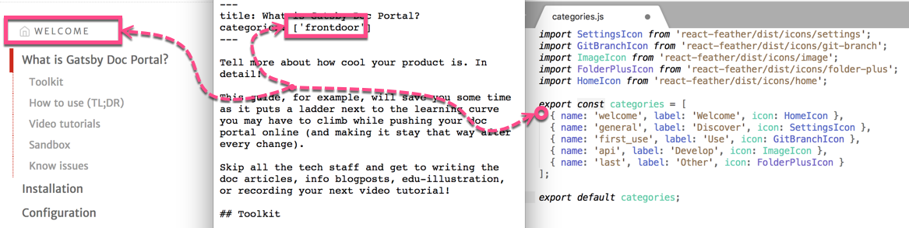

#  Docker container with Gatsby v2 for your doc portal


## PREREQUISITES

* docker installed [see instruction](https://docs.docker.com/engine/installation/linux/docker-ce/ubuntu/)
* docker-compose installed [see instruction](https://docs.docker.com/compose/install/)


## BUILD

```
$ docker-compose build --no-cache
```

## SETUP

provide your private key
```
$ cp ~/.ssh/id_rsa ./gatsby/.ssh/id_rsa
```

provide your `.gitconfig`
```
$ cp ~/.gitconfig ./gatsby/.gitconfig
```

## Prepare the doc content

### Concepts

Articles are stored in *.md files. Using categories, you group articles into sections, e.g. the articles you'd like to appear in the Getting Srtarted section should start with the following block:

```
---
title: <Articel title>  
categories: ['get-started'] 
---
```
where the <Articel title> is a placeholder for the actual title.
  
The list of categories is defined in the new_content/categories.js file. `name` is what the category is referred to in the articles. `icon` and `label` is shown in the sidebar with table of contents.  

! [Title](./doc_images/title.png)
<p align="left">
  
</p>

! [Categories](./doc_images/categories.png)
<p align="left">
  
</p>


### How to

Put the *.md files into the ./new_content/docs, and ensure that every file has a title and the category defined. Update the categories.js file to list only the categories you would like to publish.

## RUN
```
$ docker-compose up
```

## USE

By default, the content that is provided in the ./new_content folder is published to GitHub Pages automatically.

To debug, run `docker-compose down`, uncomment the lines in the ./run.sh file, run `docker-compose build` and then `docker-compose up`. Now you can use the following commands to control gatsby inside the docker-container:

### Preview
To preview the doc website,run:

```
docker exec -ti dockerized-gatsby-for-oss-docs_gatsby_1 bash
cd /root/gatsby_projects/${REPO_FOLDER}
gastby develop
```

Open http://localhost:8999/ in browser.

### Update
To edit/create the docs and improve the website, update the files in the ./shared folder.
Note: The *new_content* folder has already beed used to update the content in the *./shared* folder at this point. No chages to the new_content will take effect unless you run `docker-compose down && docker-compose build && docker-compose up` again.

### Save
To save the updates, run:

```
docker exec -ti dockerized-gatsby-for-oss-docs_gatsby_1 bash
cd /root/gatsby_projects/${REPO_FOLDER}
git add *
git commit -m "<Your commit message. Describe the changes to the content and the website>"
git push
```

### Publish
To publish the website on github.io, run:

```
docker exec -ti dockerized-gatsby-for-oss-docs_gatsby_1 bash
cd /root/gatsby_projects/${REPO_FOLDER}/${DOC_FOLDER}
npm run build:gh
```

## STOP
```
^C
...
$ docker-compose down
```
